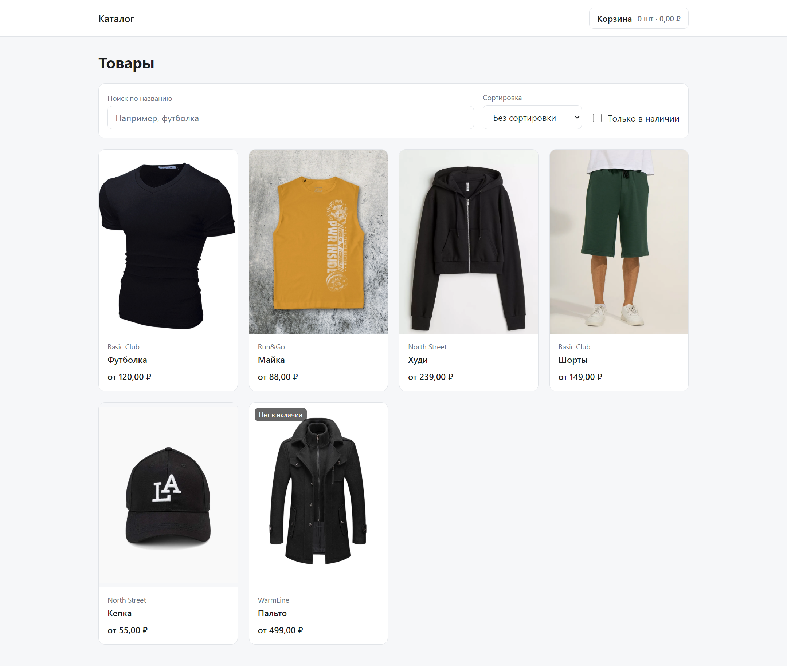

# Решение

Мини-каталог товаров: список, детальная страница, корзина. Исходное задание — [ниже](#задача).



<p align="center"><sub>Главная страница: поиск, сортировка, фильтр «в наличии», бейдж на недоступном товаре</sub></p>

## Запуск

```bash
npm ci
npm run dev      # дев-сервер на http://localhost:5173
npm run build    # проверка типов + продакшен-сборка
npm run preview  # просмотр собранного бандла
npm run lint     # ESLint, включая проверку границ слоёв
```

## Стек

React 19, TypeScript, Vite, react-router-dom v7, CSS Modules. Состояние корзины — `Context` + `useReducer`,
состояние фильтров и выбранного варианта товара — в URL через `useSearchParams`.

Шаблон переведён с Create React App на Vite отдельным коммитом: CRA не поддерживается с 2023 года.
Внешних зависимостей сверх роутера не добавлялось — склейка классов и работа с деньгами написаны вручную,
это несколько строк каждая.

## Архитектура

Feature-Sliced Design в усечённом виде: `app → pages → widgets → features → entities → shared`.
Полный набор слоёв с симметричными сегментами на трёх страницах был бы оверинжинирингом, поэтому
сегменты заводились по факту наличия. Разбор рассмотренных альтернатив (микрофронтенды, Atomic Design,
плоская структура) — в [docs/SPEC.md](docs/SPEC.md).

Направление импортов не просто задекларировано, а проверяется `eslint-plugin-boundaries`: `npm run lint`
падает на импорте вверх по слоям, на импорте соседнего слайса и на обращении во внутренности слайса
мимо его публичного `index`.

## Ключевые решения

- **`src/services/api.js` не тронут** — ни содержимого, ни расположения, диф по файлу нулевой.
  Типы описаны рядом, в `shared/api`, поверх `allowJs`.
- **Деньги считаются в целых копейках.** Цена приходит строкой `"123.00"`; арифметика во `float`
  давала бы ошибки округления на суммах корзины. Парсинг один раз при чтении, форматирование — только на выводе.
- **Позиция корзины уникальна тройкой `productId + colorId + sizeId`.** ID цвета уникален лишь внутри
  товара, одного `colorId` для ключа недостаточно.
- **Состояние в URL, а не в памяти.** Фильтры списка (`q`, `inStock`, `sort`) и выбранный вариант товара
  (`color`, `size`) живут в строке запроса, поэтому ссылку можно переслать, а перезагрузка ничего не сбрасывает.
  Параметры трактуются как недоверенный ввод: несуществующий цвет откатывается к цвету по умолчанию,
  недоступный размер считается невыбранным.
- **Выбор цвета и размера — производное состояние**, без синхронизации через `useEffect`. Сброс при смене
  товара и цвета сделан через `key`.
- **Галерея написана вручную** — по условию задания сторонние слайдеры запрещены. При одном изображении
  стрелки и миниатюры не показываются.
- **Данные из `localStorage` валидируются** при чтении: испорченное или устаревшее содержимое отбрасывается,
  а не роняет приложение.

## Сделано из необязательного

- `color` и `size` на детальной странице сохраняются в URL и восстанавливаются по ссылке.
- Промокод в корзине с разбивкой итогов «Товары / Скидка / Итого». Коды: `SALE10` и `SALE25`
  (процентные), `MINUS100` (фиксированные 100 ₽). Регистр не важен; скидка ограничена стоимостью
  товаров, поэтому итог не уходит в минус. Промокод сохраняется вместе с корзиной, а сумма в шапке
  учитывает скидку — чтобы цифры на всех экранах совпадали.

## Что в репозитории

| Файл | Зачем |
| --- | --- |
| [docs/SPEC.md](docs/SPEC.md) | спецификация: критерии приёмки, разбор модели данных, план этапов |
| [CLAUDE.md](CLAUDE.md) | правила работы над проектом — конвенции, ограничения задания |
| [docs/prompts/](docs/prompts/) | промты, по которым велась работа |

История коммитов разделена намеренно: документы → инфраструктура → сгенерированный baseline →
последующие доработки отдельными коммитами.

## Проверка

`npm run lint` и `npm run build` проходят без ошибок и предупреждений. Сценарии прогонялись в браузере:
три страницы, фильтры, добавление и изменение позиций, восстановление корзины после перезагрузки,
битые ссылки (`/product/999`, `?color=999&size=abc`), товар без единого доступного размера, цвет
с одним изображением, ширина экрана 375px. Предупреждений React в консоли нет.

---

# Задача

Реализовать мини‑каталог товаров на React.

Данные о товарах нужно получать из псевдо‑API, которое находится тут - `src/services/api.js`

Нужно сделать 3 страницы:
1. Список товаров;
2. Детальная страница товара;
3. Корзина;

Выбор библиотек для реализации страниц не ограничен.

Вёрстка и стилизация не является ключевым фактором - важнее корректность, структурность, чистота реализации.

---

## Требования

### 1) Список товаров (начальная страница)
- Показать товары с картинкой, названием и ценой (остальное по желанию).
- По клику на товар - переход на карточку товара.
- Реализовать поиск, фильтры, сортировку:
  * поиск по названию (строка)
  * фильтр "в наличии" - у товара есть хотя бы один цвет с хотя бы одним доступным размером.
  * сортировка по цене `asc`/`decs` - цену товара брать как минимальную из его цветов.

### 2) Карточка товара (детальная страница)
- Вывести информацию о товаре.
- Просмотр изображений через переключение без использования сторонних библиотек.
- Реализовать выбор цвета.
- Реализовать выбор размера:
  * показывать список всех размеров как отдельные кнопки.
  * недоступные размеры для выбранного цвета должны быть заблокированными.
- Добавление в корзину можно сделать по кнопке в количестве одной штуки за раз.
- Если товара нет - показать экран "Товар не найден" + ссылка назад.

### 3) Корзина
- Кнопка перехода в корзину должна быть на каждой странице.
- Вывод суммы количества добавленных товаров и их стоимости в кнопку перехода на страницу корзины.
- Корзина хранит уникальные позиции в связке `продукт + цвет + размер`.
- Корзина должна сохраняться в `localStorage` и восстанавливаться при перезагрузке страницы.
- Для каждой позиции поддерживается количество:
  * при добавлении уже существующей позиции увеличиваем количество на 1.
  * в корзине можно менять количество (минимум 1) и удалять позицию.
- На странице показывать:
  * список добавленных позиций: изображение, название товара, выбранный цвет, выбранный размер, цена, количество, сумму стоимости позиции.
  * общую сумму всех позиций.

### 4) UX
- Не должно быть runtime‑ошибок в обычных сценариях и особенно при старте проекта. Проверяйте, пожалуйста, перед отправкой своей работы.
- При переходах/действиях пользователь должен видеть адекватные состояния (загрузка/ошибка/пусто и т.п.).

---

## Не обязательно, но будет плюсом

Собственные дополнения не запрещены.

### 5) Состояние в URL
- Сохранять выбранный `color` и `size` на детальной странице в url и восстанавливать состояние при открытии ссылки.

### 6) Промокод
- Поле применения промокода - в корзине пересчитывается стоимость товаров с отображением скидки.
- Формат промокода и формат скидки (процентная/фиксированная) - произвольные.

---

## Ограничения
- Данные брать только из `api.js`. Недопустимо фундаментально менять структуру данных, например - перенос объектов из списка `sizes` непосредственно в объекты `colors`. Добавление новых параметров, например hex для цвета - допускается.
- Можно использовать любые библиотеки для роутинга и стейта.

---

## Формат сдачи
- Ссылка на репозиторий проекта. в README можно оставлять любые комментарии. Разворачивать рабочий билд на каком либо сервере необязательно.
- Не нужно открывать пулл реквесты в этот репозиторий.